# daily_exchange_rate
## 📝 App အကြောင်း မိတ်ဆက်
This Flutter project will be able to watch international daily exchange rate for myanmar kyat. 
မြန်မာကျပ်ငွေရဲ့နိုင်ငံတကာငွေလဲနှုန်းတွေကိုကြည့်ရှုနိုင်တဲ့applicationဖြစ်ပါတယ်။ 
UI ပိုင်းကို သပ်ရပ်ပြီးမျက်စိပသာဒဖြစ်အောင် ပြုလုပ်ထားသလို အမှောင်မုဒ် (Dark Mode) လည်းပါဝင်ပါတယ်။  
> (it is only for pracitce, not actual rate😆) 

ဒီ Project ကို Flutter (Riverpod State Management) သုံးပြီး အကောင်းဆုံး တည်ဆောက်ထားပါတယ်။

### အောက်ပါ Package🧰 တွေကိုအသုံးပြုထားပါတယ် - 
  go_router 
  flutter_riverpod 
  dio 
  shared_preferences 
  intl 
  flutter_screenutil 
  freezed_annotation 
  json_annotation 
> ⚙️ **Dev_dependencies** 
  flutter_launcher_icons 
  freezed 
  json_serializable 
  build_runner 

I use api of this link **https://forex.cbm.gov.mm/api**
  
Good Luck & Have Fun ✌️✌️✌️ 
Happy Code 💻 
Happy Life ❤️‍🔥

## 📥 Download App

App ကို စမ်းသုံးကြည့်ချင်ရင် အောက်က Link မှာ APK ရယူနိုင်ပါတယ် -

## 🖼️ App Preview

  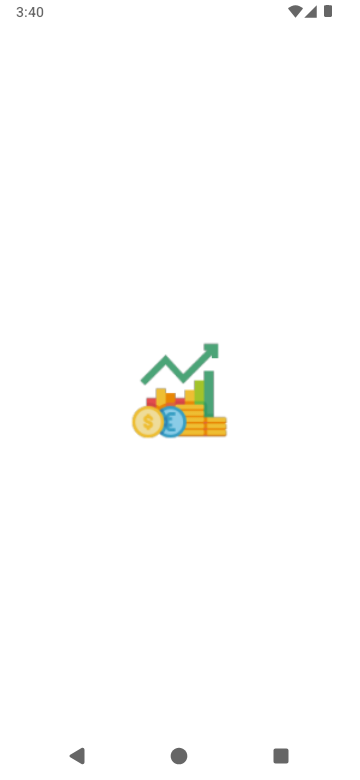
  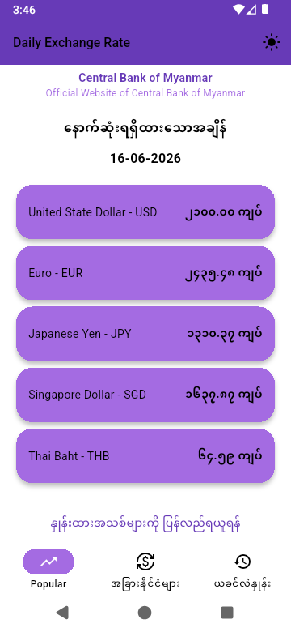
  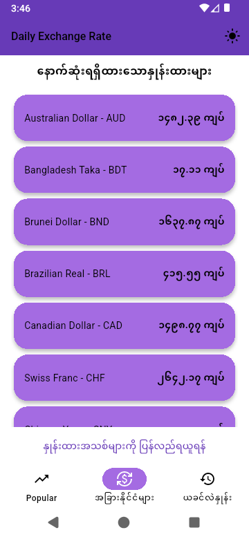
  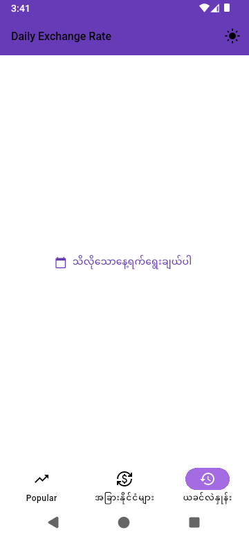
  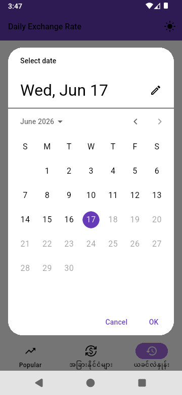
  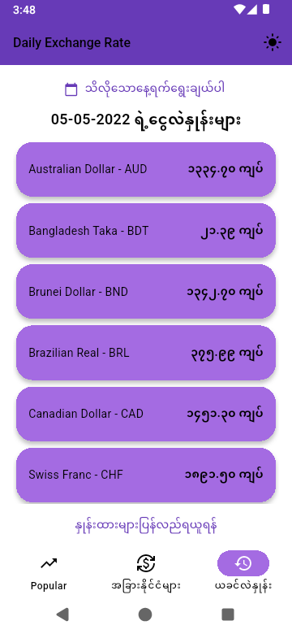
  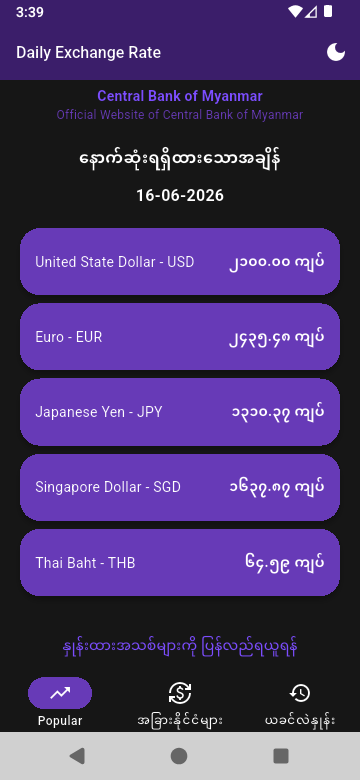
  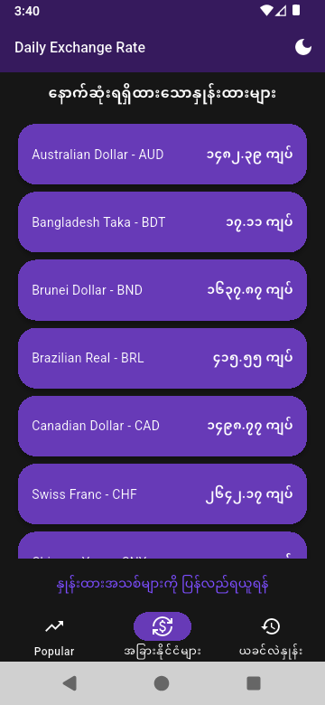
  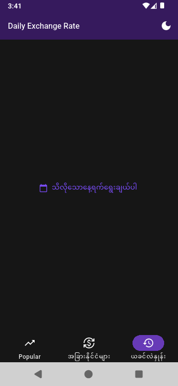
  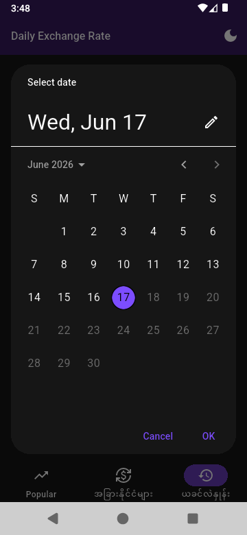
  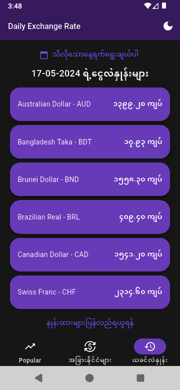

